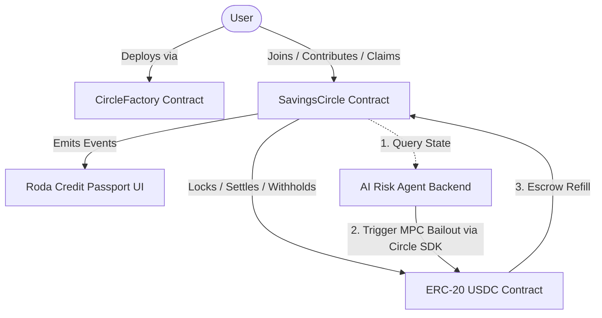

# Roda — Trustless Rotating Savings Circles on Arc


> **Onchain Rotating Savings and Credit Association (ROSCA) powered by USDC on Arc L1.**

Built with passion and expertise by **[Leknax](https://github.com/Lesnak1)**.

---

## Naming & Philosophy

In Afro-Brazilian capoeira and samba culture, the **roda** is the human circle where participants gather and take turns entering the center. This is a perfect metaphor for a Rotating Savings and Credit Association (ROSCA): a group of individuals who each contribute a fixed amount every round, and take turns receiving the entire collected pot.

Traditional real-world ROSCAs (known as *tanda*, *susu*, *stokvel*, *gün*, or *para günü*) are highly vulnerable to trust failures: organizers can abscond with the funds, or early beneficiaries can default on subsequent rounds. **Roda removes the organizer and social trust requirements entirely through smart contract execution.**

---

## Key Features & Ultra-Premium UX

1. **🧮 ROSCA Capital Efficiency Calculator:** Interactive slider simulator comparing Roda's single-contribution collateral against traditional 150% over-collateralized DeFi protocols. Proves up to **7.5x Capital Efficiency** and collateral savings in real-time.
2. **🛡️ Circle Solvency & Health Gauge:** On-chain health badge rendering **"%100 Fully Solvent & Escrow Protected"**, verifying that every circle round is mathematically collateralized by escrow and dynamic withholding rules.
3. **💳 Roda Credit Passport & X/Twitter Share Modal:** Apple/Revolut-styled 3D credit passport card featuring ERC-8004 Agent ID `#849938`, repayment rates, HTML5 Canvas PNG card download, and Twitter Web Intent integration with automatic Twitter Card rendering.
4. **🔗 One-Click Circle Invite & QR Generator:** Instant shareable invite link (`?circle=0x...`) and SVG QR code generator for recruiting new circle members.
5. **⚡ Live On-Chain Activity Ticker:** Streams real-time `CircleFactory` deployments and `REPUTATION_REGISTRY` feedback events from Arc Testnet into an auto-scrolling header ticker.
6. **🌌 Quantum Liquidity Orbital Background:** 3D perspective GPU-accelerated background frame animations (`perspective: 1200px`) featuring rotating yörünge rings and pulsing participant nodes.
7. **🤖 Autonomous AI Liquidity Guardian:** Features an AI risk agent that monitors circle defaults and executes automated on-chain bailout transactions using Circle's Developer-Controlled Wallets API.
8. **🔒 Trustless Escrow & Dynamic Withholding:** Contributions are locked in smart contract escrow, and lifetime default deficits are automatically refilled during `closeRound()` settlement.
9. **⚡ Monetized x402 Nanopayments API:** Agent service endpoint (`/api/risk-report`) selling real-time AI credit risk analysis at **$0.001 per query** using the x402 Payment Required protocol (aligned with Lepton RFB 02).
10. **🖥️ Live AI Guardian Terminal:** Interactive terminal UI streaming real-time timestamped logs of on-chain verification, AI risk reasoning, and ERC-8004 reputation logging.

---

## Protocol Architecture



---

## Repository Structure

```text
roda/
├─ contracts/                      Foundry project (Solidity 0.8.28)
│  ├─ src/SavingsCircle.sol        Core circle: join → contribute → closeRound → claimPayout → withdrawCollateral
│  ├─ src/CircleFactory.sol        Deploys and indexes circles for public discovery
│  ├─ test/SavingsCircle.t.sol     Comprehensive 13-test unit suite (100% pass)
│  ├─ script/Deploy.s.sol          Deploys CircleFactory to Arc Testnet
│  └─ foundry.toml & remappings.txt
├─ web/                            Next.js (App Router) + Wagmi v2 + Viem dApp
│  ├─ public/                      Static brand assets (logo, logo_with_text, logo_typography)
│  ├─ src/app/                     Pages (Home, About, Docs) & global styles (layout.tsx, globals.css)
│  ├─ src/components/              UI widgets & Ultra-Premium Modules
│  │  ├─ ActivityTicker.tsx        Live Arc Testnet event ticker
│  │  ├─ CircleInviteModal.tsx     Invite link & QR code generator
│  │  ├─ RodaPassportCard.tsx      3D Credit Passport & Twitter share modal
│  │  ├─ RoscaCalculator.tsx       ROSCA vs 150% DeFi capital efficiency simulator
│  │  └─ CircleDetail, ReputationPanel, AIGuardianPanel, IntegrationsPanel
│  ├─ src/lib/                     Arc chain config, ABIs, formatters & L2 simulation layer
│  └─ package.json & next.config.mjs
└─ README.md
```

---

## Arc Decimal Contexts (Crucial)

Arc features a stablecoin-first native architecture. However, this introduces two decimal contexts that must never be mixed:
* **Native Gas USDC:** 18 decimals. Checked using standard wallet balances (e.g. `useBalance`).
* **ERC-20 USDC:** 6 decimals. Used for all contract token transfers, deposits, pots, and payouts (Testnet address: `0x3600000000000000000000000000000000000000`).

---

## Smart Contracts Setup (Foundry)

### 1. Install dependencies
Ensure Foundry is installed, then run:
```bash
cd contracts
forge install --no-git foundry-rs/forge-std
forge install --no-git OpenZeppelin/openzeppelin-contracts
```

### 2. Configure Environment
Copy the example file and update with a testnet private key (include `0x` prefix):
```bash
cp .env.example .env
```

### 3. Build & Test
```bash
forge build
forge test -vvv
```

### 4. Deploy to Arc Testnet
```bash
forge script script/Deploy.s.sol:Deploy --rpc-url https://rpc.testnet.arc.network --broadcast
```
Copy the printed `CircleFactory` address.

---

## Web Frontend Setup (Next.js)

### 1. Install packages
```bash
cd web
npm install
```

### 2. Configure Environment
Copy the environment template and set the factory address to your deployed contract:
```bash
cp .env.example .env.local
```

### 3. Production Build Validation
```bash
npm run build
```

### 4. Run Development Server
```bash
npm run dev
```
Open [http://localhost:3000](http://localhost:3000) or [http://localhost:3005](http://localhost:3005) to interact with the dApp.

---

## Deploying to Vercel

To deploy Roda to Vercel:
1. **Import Repository:** Import the repository into your Vercel dashboard.
2. **Root Directory:** Set the Root Directory configuration to `web` under your Project Settings.
3. **Environment Variables:** Define the following variables in the Vercel dashboard:
   - `NEXT_PUBLIC_FACTORY_ADDRESS` (deployed `CircleFactory` address)
   - `NEXT_PUBLIC_USDC_ADDRESS` (`0x3600000000000000000000000000000000000000`)
   - `NEXT_PUBLIC_ARC_RPC_URL` (custom RPC like Alchemy to bypass public node rate limits)
   - `CIRCLE_API_KEY` (Circle Developer Wallets API Key)
   - `CIRCLE_ENTITY_SECRET` (Circle entity secret hex string)
   - `AI_AGENT_WALLET_ID` (Circle Developer-Controlled Wallet ID for liquidity execution)
   - `AI_AGENT_VALIDATOR_WALLET_ID` (Circle Developer-Controlled Wallet ID for validator reputation logging)
   - `AI_API_KEY` (Autonomous AI model API key)
4. **Deploy:** Hit deploy. Vercel will automatically compile, optimize, and launch your dApp!

---

## Security Model & Hardened Economic Safety

Roda is designed as a trustless, mathematically secured financial protocol. Following professional audits, Roda has been hardened against common ROSCA trust failures:

### 1. Recruiting Deadlines & Creator Cancellation
* **Join Deadlines:** Every circle has a `joinDeadline` calculated dynamically from its configuration. No member can join a circle after the deadline has expired, protecting circles from freezing due to incomplete registrations.
* **Circle Cancellation:** If a circle fails to fill before the deadline, or if the group decides to dissolve early, the circle creator can call `cancelCircle()`. This transitions the contract to the `Cancelled` state, unlocking all funds.
* **Instant Collateral Refunds:** Members can withdraw their locked collateral at any time during `Recruiting` using `leave()`, or retrieve it after cancellation using `withdrawCollateral()`.

### 2. Dynamic Collateral Withholding (100% Deficit Prevention)
* **The Vulnerability:** In traditional ROSCA models, if a member receives the pot early and subsequently defaults on *multiple* later rounds, their single locked collateral only covers their first default, leading to deficits for subsequent beneficiaries.
* **Roda's Solution:** During the **close-time settlement (`closeRound()`)**, Roda calculates the beneficiary's remaining lifetime liability in the circle (`contributionAmount * remaining_rounds`). If this liability exceeds their current locked collateral, Roda automatically withholds the difference directly from the gross round pot and immediately refills their locked collateral escrow.
* **Mathematical Deficit Elimination:** This close-time dynamic withholding guarantees that early beneficiaries are always 100% collateralized against all future contributions, regardless of when they choose to pull/claim their payout.

### 3. Dual-Wallet Validator Design (ERC-8004 Workaround)
* **The Vulnerability:** The ERC-8004 registry implementation reverts self-feedback transactions to prevent reputation manipulation. If the agent owner wallet attempts to report reputation scores directly on its operations, the registry blocks the transaction.
* **Roda's Solution:** We implemented a dual-wallet security design. The primary owner wallet (`AI_AGENT_WALLET_ID`) handles liquidity management and transaction execution, while a separate validator wallet (`AI_AGENT_VALIDATOR_WALLET_ID`) submits feedback logs to the `ReputationRegistry`. This ensures compliance with registry rules while keeping reporting completely decoupled.

---

## Roadmap & Arc Integrations (v2)

### 1. Circle CCTP Onboarding ("Bridge & Join")
Integrate Circle's Cross-Chain Transfer Protocol (CCTP) directly into the Roda onboarding wizard to allow users to join a Roda circle using USDC from external networks (e.g. Arbitrum, Base, Optimism, or Solana) and settle natively on Arc.

### 2. Opt-in Selectively Shielded Privacy
Implement selectively shielded privacy utilizing Arc's privacy-preserving layer, keeping payment reputation public while shielding sensitive details like payment amounts and group member addresses.

### 3. Attested Roda Passport Credentials
Convert Roda Passport reputation profiles into non-transferable EAS (Ethereum Attestation Service) badges or Soulbound Tokens (SBTs) to enable undercollateralized lending across the Arc ecosystem.
